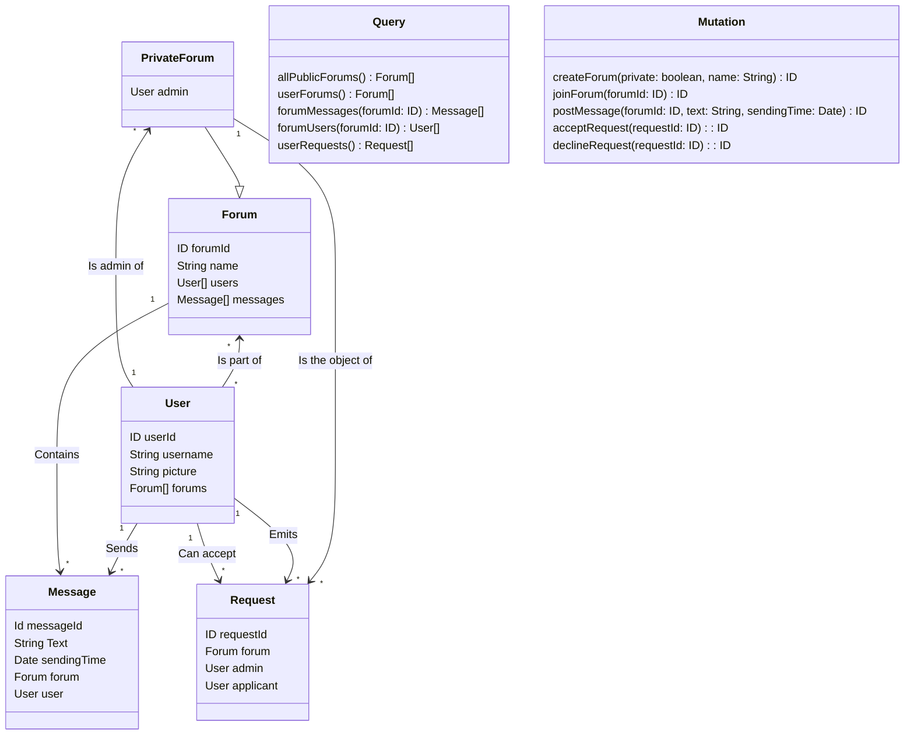

# Freshplanet Coding Test -- Chat App Part 2

## New GraphQL schema

The main changes are:

- the private forums constitue a new class which inherits from the Forum class, but they also have an "admin" attribut, due to a new relationship with the User class.
- a new class, Request, is created to store the requests of users to join a private forum.
- a user can see if he has some requests of admission from other users with the `userRequests()` query.
- When a user wants to join a forum, he uses the joinForum(forumId: ID) query, which will just generates a request if the forum is a private forum.
- An admin can accept a request, and the other user will join the forum, or decline it with the queries `acceptRequest(requestId : ID)` and `declineRequest(requestId : ID)`.
