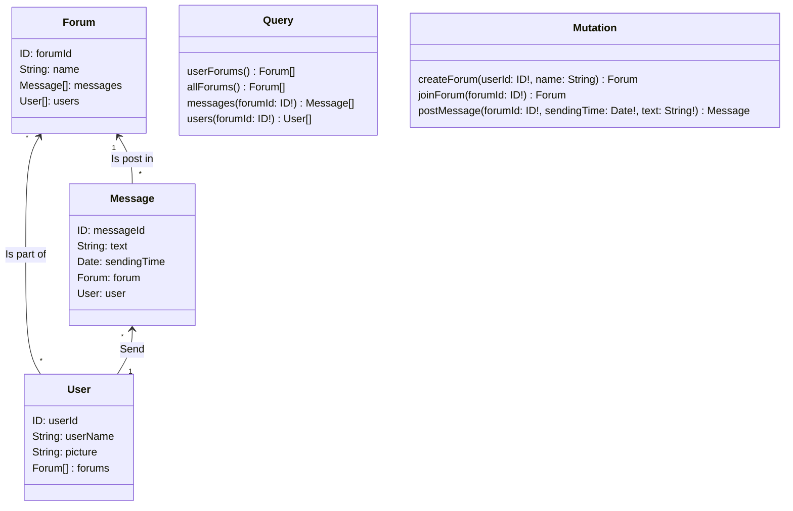

# Freshplanet Coding Test -- Chat App

## Setup for development

1. Install Node.js on your machine.
2. Download the backend repo on your computer
3. Open the backend repo in order to be in the root folder, and run `npm install`
4. To launch the server, run `npm run dev`
5. You will be able to execute queries at http://localhost:3000

## GraphQL Schema

In order to be able to correctly preview the [mermaid](https://mermaid-js.github.io/mermaid/#/) diagrams and charts coded in the markdown files, you need to install a Mermaid extension on your editor.  
Such feature is directly available on GitHub, when previewing markdown files.

