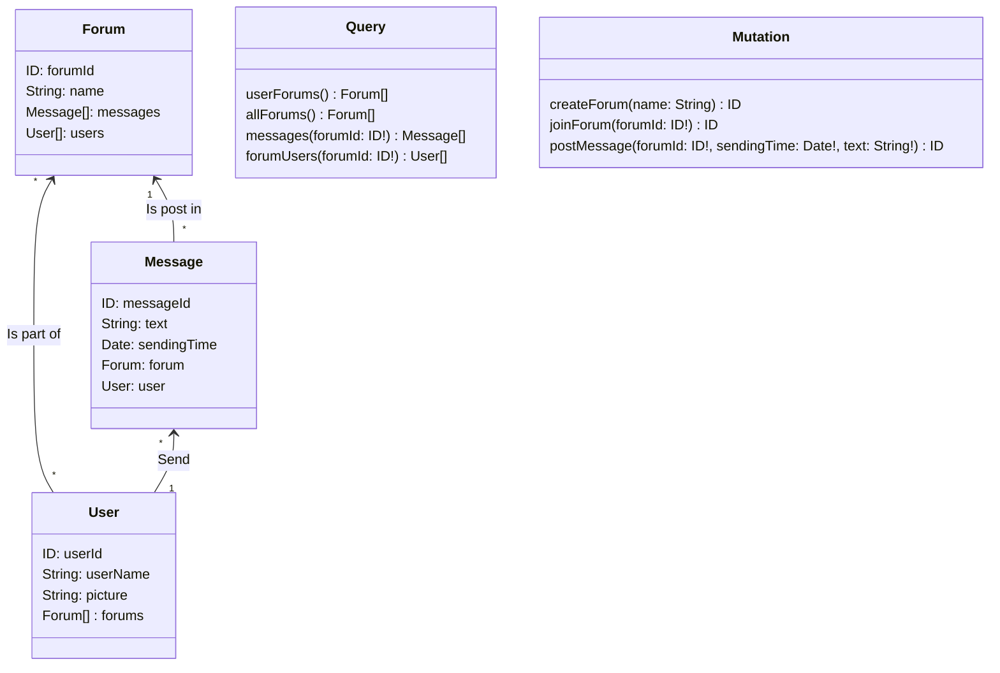

# Freshplanet Coding Test -- Chat App Part 1

## Setup for development

1. Install Node.js on your machine.
2. Download the backend repo on your computer
3. Open the backend repo in order to be in the root folder, and run `npm install`
4. To launch the server, run `npm run dev`
5. You will be able to execute queries at http://localhost:3000

## Authentication

Since the authentication of the user is supposed to be done, the id of the user is put in the "Authorization" parameter of the request headers, which can easily be set in the Apollo Sandbox. In the `fixtures.json` file there is 5 users, and the different userId are: 1, 2, 3, 4, 5.
This id is used in several queries, for example to create a new forum or to post a new message.
A verification of the authorization to do some requests (for exemple to check that the login user is in the forum if he looks for the users of a forum) could also be done.

## GraphQL Schema

In order to be able to correctly preview the [mermaid](https://mermaid-js.github.io/mermaid/#/) diagrams and charts coded in the markdown files, you need to install a Mermaid extension on your editor.  
Such feature is directly available on GitHub, when previewing markdown files.

